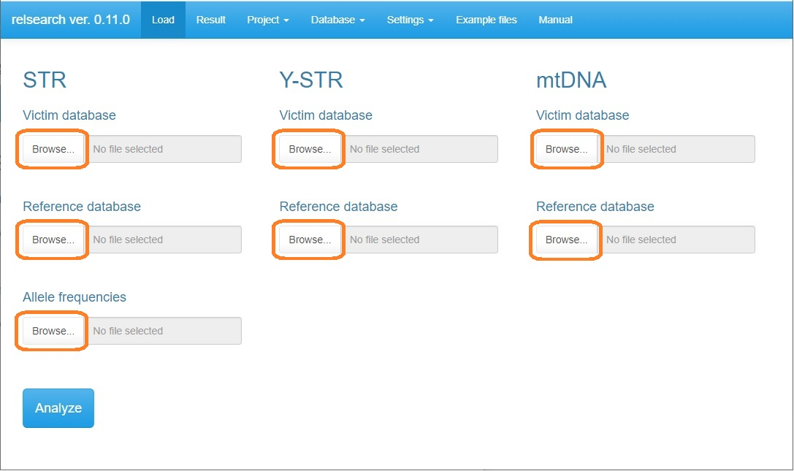
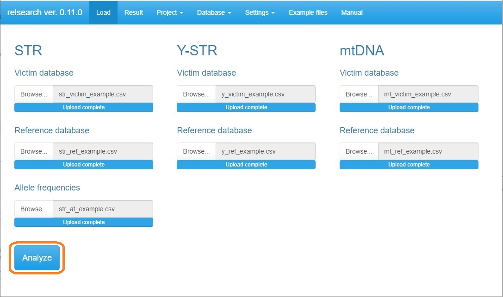
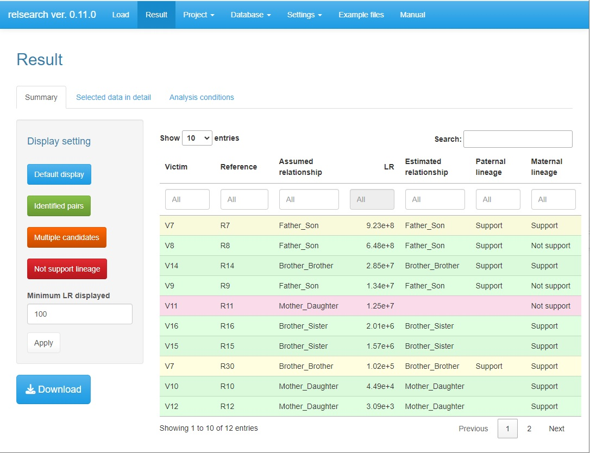
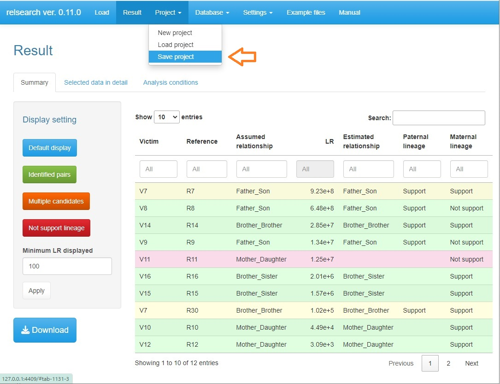
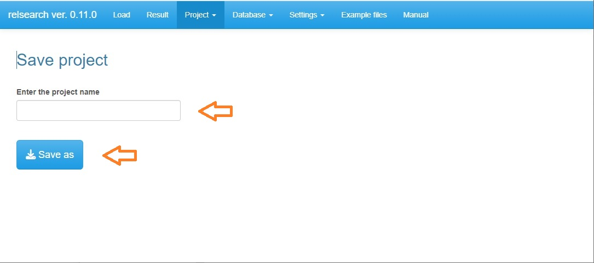

```{r setup, include = FALSE}
knitr::opts_chunk$set(tidy = TRUE, tidy.opts = list(width.cutoff = 60))
library(knitr)
library(kableExtra)
```

\newpage

# Initial setup

1. Ensure that R (>= 4.4.0) is installed. It is available from the [R Development Core Team website](http://www.R-project.org).

2. Begin an R session.

3. Execute the following command in R to install required packages.

&nbsp;

```{r eval = FALSE}
install.packages(c("shiny", "data.table", "dplyr", "DT", "magrittr", "pandoc", "pedtools", "Rcpp", "ribd", "rmarkdown", "shinyFeedback", "shinyjs", "shinythemes", "waiter"))
```

&nbsp;

4. Download ”relsearch_1.0.0.zip” from the [GitHub repository page](https://github.com/manabe0322/relsearch/releases).

5. Install ”relsearch_1.0.0.zip” from ”Install package(s) from local files...”.

\newpage

# Quick guide

1. Execute the following commands in R to start GUI.

&nbsp;

```{r eval = FALSE}
library(relsearch)
relsearch()
```

&nbsp;

2. Load files from each **"Browse..."** button.



**Note** See section [Files](#sec_files) for information on each file.

\newpage

3. Click the **"Analysis"** button.



\newpage

4. After finishing the analysis, the result window is automatically opened.



**Note** See section [Result](#sec_result) for navigation of the result window.

\newpage

5. Select **Project** $\blacktriangleright$ **Save project**.



\newpage

6. Enter the project name and click the **"Save as"** button.



**Note** The saved project can be loaded from **Project** $\blacktriangleright$ **Load project**. How to handle projects is described in section [Other functions](#sec_other_func).

\newpage

# Files {#sec_files}

## STR: Victim database

```{r, echo = FALSE}
df_v_auto_ex <- data.frame(SampleName = c("Victim1", "Victim2", "Victim3", "Victim4", "Victim5", "Victim6", "Victim7", "Victim8", "Victim9", "Victim10", "︙"), 
                           D3S1358 = c("17", "17", "15", "15", "15", "16", "14", "16", "15", "15", "︙"), 
                           D3S1358 = c("17", "", "17", "18", "15", "16", "15", "18", "15", "16", "︙"), 
                           vWA = c("17", "18", "17", "15", "18", "17", "17", "17", "16", "18", "︙"), 
                           vWA = c("", "18", "18", "18", "", "", "18", "18", "18", "19", "︙"), 
                           D16S539 = c("11", "", "10", "9", "9", "", "12", "11", "11", "9", "︙"), 
                           D16S539 = c("", "", "10", "12", "9", "", "", "", "11", "10", "︙"), 
                           CSF1PO = c("12", "10", "10", "11", "10", "10", "", "9", "12", "12", "︙"), 
                           CSF1PO = c("", "11", "12", "12", "", "13", "", "12", "12", "12", "︙"), 
                           TPOX = c("", "8", "8", "8", "9", "8", "8", "8", "8", "8", "︙"), 
                           TPOX = c("", "", "11", "8", "11", "8", "8", "", "11", "11", "︙"))

kable(df_v_auto_ex, format = "latex", booktabs = T, label = NA) %>%
  kable_styling(latex_options = "HOLD_position", font_size = 10)
```

**Note**

- File type: .csv

- This file requires the column "SampleName" and columns for each marker (two columns in each).

- The marker with two empty cells (e.g., TPOX of sample "Victim1" in the above table) is ignored when calculating the likelihood ratio.

- The marker with one empty cell (e.g., vWA of sample "Victim1" in the above table) can be regarded as both homozygote (i.e., no drop-out) and heterozygote with drop-out of one allele when calculating the likelihood ratio.

&nbsp;

## STR: Reference database

```{r, echo = FALSE}
df_r_auto_ex <- data.frame(SampleName = c("Reference1", "Reference2", "Reference3", "Reference4", "Reference5", "Reference6", "Reference7", "Reference7", "Reference8", "Reference9", "Reference10", "︙"), 
                           Relationship = c("Father_Son", "Father_Son", "Father_Son", "Father_Son", "Brother_Brother", "Brother_Brother", "Brother_Brother", "Father_Son", "Brother_Brother", "Uncle_Nephew", "Uncle_Nephew", "︙"),
                           D3S1358 = c("17", "17", "15", "15", "15", "16", "16", "16", "15", "15", "15", "︙"), 
                           D3S1358 = c("17", "18", "16", "16", "16", "17", "17", "17", "16", "15", "16", "︙"), 
                           vWA = c("14", "17", "17", "15", "15", "17", "14", "14", "17", "14", "17", "︙"), 
                           vWA = c("17", "18", "18", "18", "18", "17", "18", "18", "18", "16", "", "︙"), 
                           D16S539 = c("10", "12", "9", "9", "9", "10", "9", "9", "9", "10", "9", "︙"), 
                           D16S539 = c("10", "13", "10", "9", "9", "12", "9", "9", "12", "11", "12", "︙"), 
                           CSF1PO = c("12", "10", "11", "10", "10", "13", "12", "12", "11", "11", "", "︙"), 
                           CSF1PO = c("12", "11", "12", "12", "12", "13", "15", "15", "12", "12", "", "︙"), 
                           TPOX = c("8", "11", "8", "9", "9", "9", "8", "8", "8", "8", "8", "︙"), 
                           TPOX = c("8", "11", "8", "11", "11", "11", "8", "8", "9", "9", "12", "︙"))
```

**Note**

- File type: .csv

- This file requires the columns "SampleName", "Relationship", and columns for each marker (two columns in each).

- The relationship of a missing family member should be designated in the column "Relationship". The names of the relationship need to be pre-defined in **Settings** ▶ **Relationships** (see section [Setting](#sec_setting_rel)).

- If a reference has multiple missing family members, add rows for each relationship of the members (e.g., sibling and parent-child of the sample "Reference7" in the above table).

- The marker with two empty cells (e.g., CSF1PO of sample "Reference10" in the above table) is ignored when calculating the likelihood ratio.

- The marker with one empty cell (e.g., vWA of sample "Reference10" in the above table) can be regarded as both homozygote (i.e., no drop-out) and heterozygote with drop-out of one allele when calculating the likelihood ratio.

## STR: Allele frequencies

```{r, echo = FALSE}
df_af_ex <- data.frame(Allele = c("10", "10.1", "10.2", "10.3", "11", "11.1", "11.2", "11.3", "12", "12.2", "13", "13.2", "14", "︙"), 
                       D3S1358 = c("", "", "", "", "", "", "", "", "0.02324", "", "0.001328", "", "0.02656", "︙"), 
                       vWA = c("", "", "", "", "", "", "", "", "", "", "0.000664", "", "0.194887", "︙"), 
                       D16S539 = c("0.200266", "", "", "", "0.186981", "", "", "", "0.172036", "", "0.069744", "", "0.008967", "︙"), 
                       CSF1PO = c("0.215471", "", "", "", "0.206175", "", "", "", "0.420983", "", "0.069389", "", "0.017596", "︙"), 
                       TPOX = c("0.033566", "", "", "", "0.356597", "", "", "", "0.038219", "", "0.001329", "", "0.000997", "︙"))
```

**Note**

- File type: .csv

- This file requires the columns "Allele" and columns for each marker (one column in each).

&nbsp;

## Y-STR: Victim database

**Note**

- File type: .csv

- This file requires the column "SampleName" and columns for each marker (one column in each).

- In the marker with more than one allele, each allele must be separated by a comma without any spaces (e.g., DYS385).

- The marker with an empty cell (e.g., DYS456 of sample ‘Victim6’) is ignored for analysis.

&nbsp;

## Y-STR: Reference database

**Note**

- File type: .csv

- This file requires the column "SampleName", "Relationship", and columns for each marker (one column in each).

- The relationship of a missing family member should be designated in the column "Relationship". The name of the relationship should be defined in Settings > Relationships.

- If a reference has multiple missing family members, add rows for each relationship of the members (e.g., sibling and parent-child of the sample "Reference7" in the above table).

- In the marker with more than one allele, each allele must be separated by a comma without any spaces (e.g., DYS385).

- The marker with an empty cell (e.g., DYS518 of sample ‘Reference10’) is ignored for analysis.

&nbsp;

## mtDNA: Victim database

**Note**

- File type: .csv

- This file requires the column "SampleName", "Range", and "Haplotype".

&nbsp;

## mtDNA: Reference database

**Note**

- File type: .csv

- This file requires the column "SampleName", "Relationship", "Range", and "Haplotype".

- The relationship of a missing family member should be designated in the column "Relationship". The name of the relationship should be defined in Settings > Relationships.

- If a reference has multiple missing family members, add rows for each relationship of the members (e.g., sibling and parent-child of the sample "Reference7" in the above table).

&nbsp;

\newpage

# Setting {#sec_setting}

## Criteria

You can set the following criteria to support the assumed relationship. Press the **Save** button to reflect the changes. Press the **Reset** button if you want to return to default values.

### STR

- Minimum LR: The minimum likelihood ratio that supports the assumed relationship

### Y-STR

- Maximum number of mismatched loci: The upper limit of the number of mismatched loci between victim and reference profiles to support paternal lineage.

- Maximum total mutational steps: The upper limit of total mutational steps (i.e., sum of mutational steps of all loci) between victim and reference profiles to support paternal lineage.

### mtDNA

- Maximum number of inconsistency: The upper limit of inconcistency between victim and reference profiles to support maternal lineage.

&nbsp;

## Relationship {#sec_setting_rel}

## Mutation rate

## Other parameters

You can set the minimum allele frequency which is used for the unobserved alleles. Press the **Save** button to reflect the changes. Press the **Reset** button if you want to return to the default value.

\newpage

# Result {#sec_result}

\newpage

# Other functions {#sec_other_func}

## Project

## View database

## Example files

Example files for each database can be downloaded from the **Example files** tab.

\newpage

# Computational principle

## STR

### Likelihood ratio

The likelihood ratio (LR) is calculated for each victim-reference pair by assuming the following two hypotheses:

$H_{1}$: The victim and the reference are a certain relationship,

$H_{2}$: The victim and the reference are unrelated.

The equation of the LR is as follows:

$$
LR = \frac{Pr(G_{v}, G_{r}|H_{1})}{Pr(G_{v}, G_{r}|H_{2})}
$$

where $G_{v}$ and $G_{r}$ denote the genotypes of the victim and the reference, respectively.

In RelSearch, users can set the minimum threshold of the LR to support $H_{1}$. The default threshold is 100, which is determined based on the verbal scale "Moderate Support" written in the Scientific Working Group on DNA Analysis Methods (SWGDAM) guideline[@SWGDAM2018].

The LR without considering allelic drop-out and mutations is calculated based on the method of Wenk et al[@Wenk1996].

## Y-STR

## mtDNA

\newpage

# Reference {-}

<div id="refs"></div>

