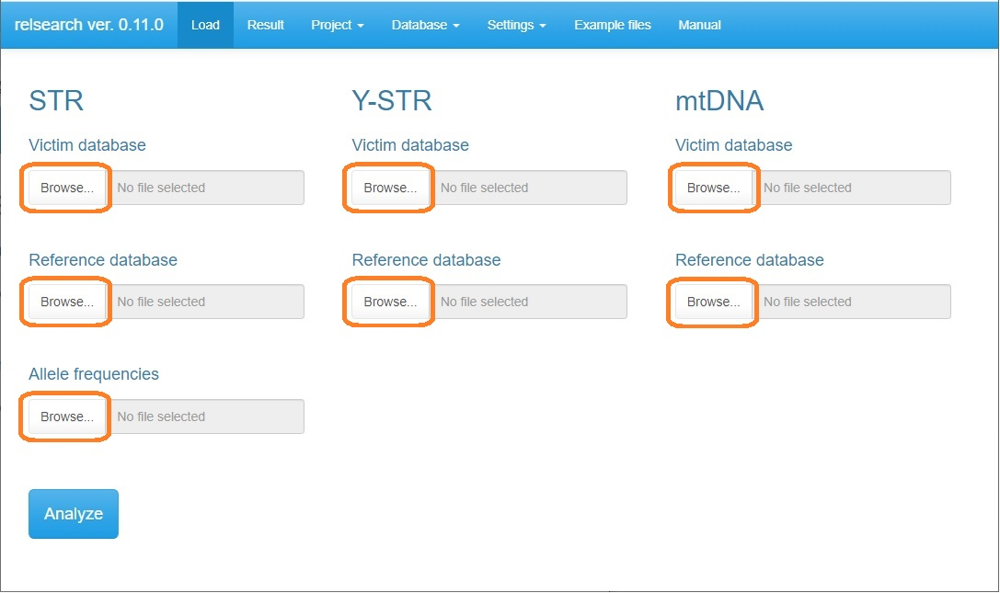
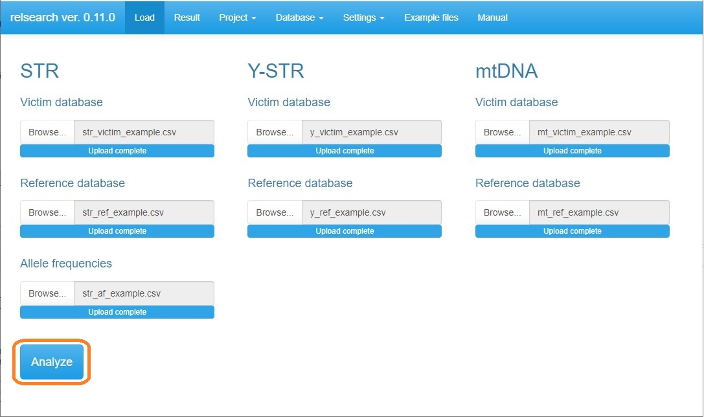
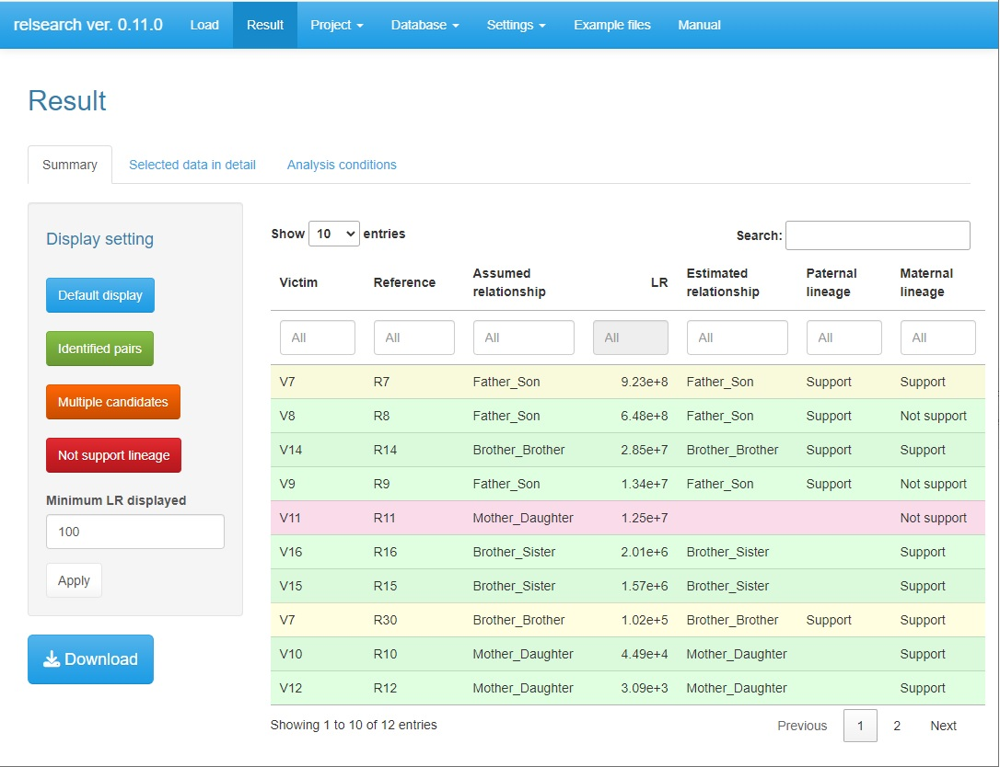
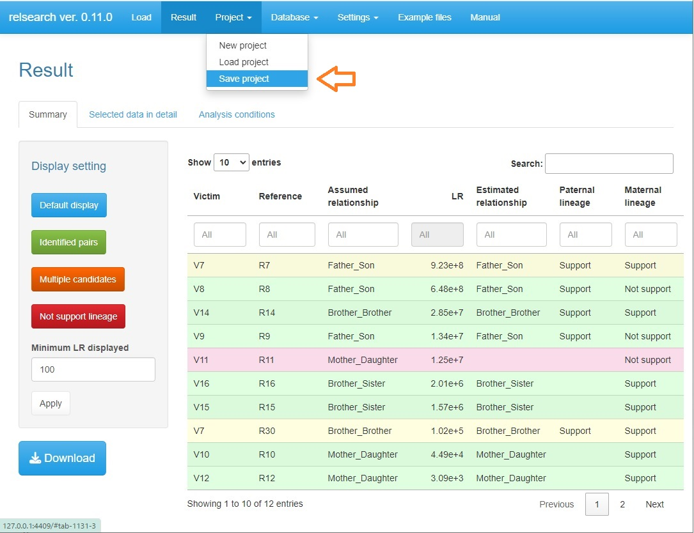

```{css, echo = FALSE}
body{
  font-family: "Helvetica Neue", "Helvetica", "Hiragino Sans", "Hiragino Kaku Gothic ProN", "Arial", "Yu Gothic", "Meiryo", sans-serif;
  font-size: 16px;
  color: #333333;
}

table，th, td{
  font-size: 14px;
  color: #333333;
}

h1{
  font-family: "Helvetica Neue", "Helvetica", "Hiragino Sans", "Hiragino Kaku Gothic ProN", "Arial", "Yu Gothic", "Meiryo", sans-serif;
}

h2{
  padding: 1rem 2rem;
  background: #f4f4f4;
  font-family: "Helvetica Neue", "Helvetica", "Hiragino Sans", "Hiragino Kaku Gothic ProN", "Arial", "Yu Gothic", "Meiryo", sans-serif;
}

h3{
  padding: 1rem 2rem;
  border-left: 4px solid #333333;
  font-family: "Helvetica Neue", "Helvetica", "Hiragino Sans", "Hiragino Kaku Gothic ProN", "Arial", "Yu Gothic", "Meiryo", sans-serif;
}

h4{
  font-family: "Helvetica Neue", "Helvetica", "Hiragino Sans", "Hiragino Kaku Gothic ProN", "Arial", "Yu Gothic", "Meiryo", sans-serif;
}

p{
  font-family: "Helvetica Neue", "Helvetica", "Hiragino Sans", "Hiragino Kaku Gothic ProN", "Arial", "Yu Gothic", "Meiryo", sans-serif;
}
```

```{r setup, include=FALSE}
knitr::opts_chunk$set(echo = TRUE)
```

---

## Initial setup

1. Ensure that R (>= 4.3.3) is installed. It is available from the <a href="http://www.R-project.org" target="_blank">R Development Core Team website</a>.

2. Begin an R session.

3. Execute the following command in R to install required packages.

```
install.packages(c("shiny", "data.table", "dplyr", "DT", "magrittr", "pandoc", "pedtools", "Rcpp", "ribd", "rmarkdown", "shinyFeedback", "shinyjs", "shinythemes", "waiter"))
```

4. Download ”relsearch_1.0.0.zip” from the <a href="https://github.com/manabe0322/relsearch/releases" target="_blank">GitHub repository page</a>.

5. Install ”relsearch_1.0.0.zip” from ”Install package(s) from local files...”.

---

## Quick guide

1. Execute the following commands in R to start GUI.

```
library(relsearch)
relsearch()
```

<br>

2. Load files from each **"Browse..."** button.



<br>

3. Click the **"Analysis"** button.



<br>

4. After finishing the analysis, the result window is automatically opened.



**Note** See Section [Result](#sec_result) for navigation of the result window

<br>

5. Select **Project** ▶ **Save project**.



<br>

6. Enter the project name and click the **"Save as"** button.


**Note** The saved project can be loaded from **Project** ▶ **Load project**. How to handle projects is described in section [Other functions](#sec_other_func).

<br>

---

<a id="sec_files"></a>

## Files

### STR: Victim database

### STR: Reference database

### STR: Allele frequencies

### Y-STR: Victim database

### Y-STR: Reference database

### mtDNA: Victim database

### mtDNA: Reference database

---

<a id="sec_setting"></a>

## Setting

### Criteria

### Relationship

### Mutation rate

### Other parameters

---

<a id="sec_result"></a>

## Result

---

<a id="sec_other_func"></a>

## Other functions

### Project

### View database

### Example files

---

## Computational principle

### STR

### Y-STR

### mtDNA

