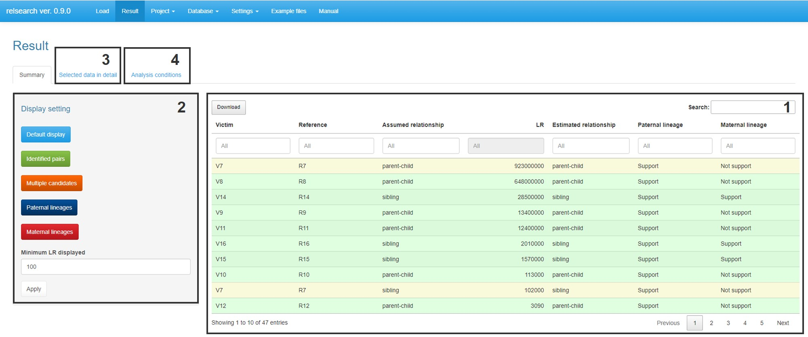
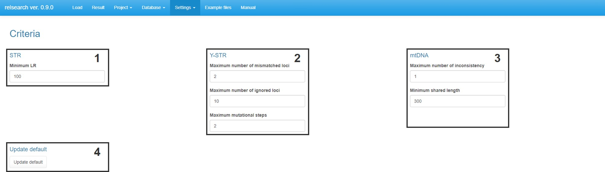
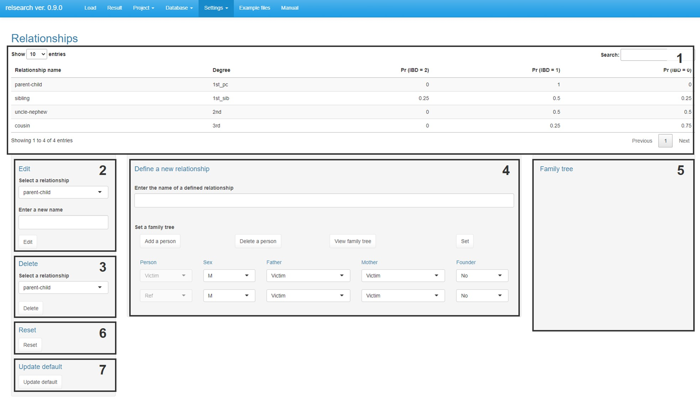
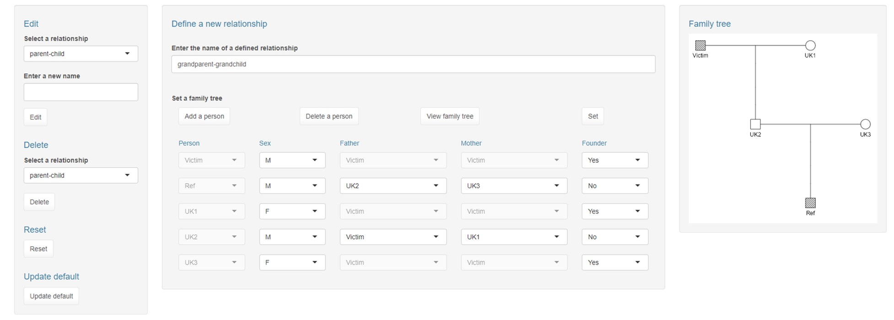
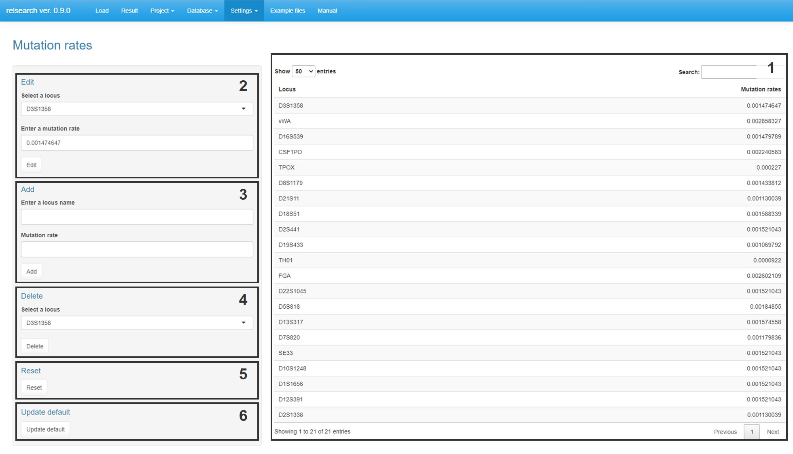
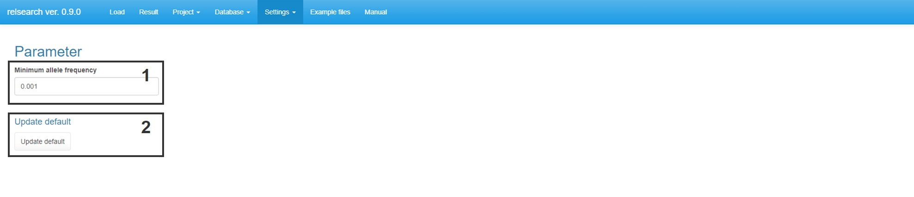

<script type="text/javascript" async src="https://cdnjs.cloudflare.com/ajax/libs/mathjax/2.7.7/MathJax.js?config=TeX-MML-AM_CHTML">
</script>
<script type="text/x-mathjax-config">
 MathJax.Hub.Config({
 tex2jax: {
 inlineMath: [['$', '$'] ],
 displayMath: [ ['$$','$$'], ["\\[","\\]"] ]
 }
 });
</script>

## Contents

* [Getting started](#sec1)

* [Overall flow](#sec2)

  * [Load files](#sec2-1)
  
  * [Check settings](#sec2-2)

  * [Perform analysis](#sec2-3)

  * [Check results](#sec2-4)
  
  * [Save project](#sec2-5)
  
* [File format](#sec3)

  * [STR: Victim database](#sec3-1)

  * [STR: Reference database](#sec3-2)

  * [STR: Allele frequencies](#sec3-3)

  * [Y-STR: Victim database](#sec3-4)

  * [Y-STR: Reference database](#sec3-5)

  * [mtDNA: Victim database](#sec3-6)

  * [mtDNA: Reference database](#sec3-7)

* [Settings](#sec4)

  * [Criteria](#sec4-1)
  
  * [Relationships](#sec4-2)
  
  * [Mutation rates](#sec4-3)
  
  * [Minimum allele frequency](#sec4-4)

* [Calculation principle](#sec5)

  * [STR](#sec5-1)
  
  * [Y-STR](#sec5-2)
  
  * [mtDNA](#sec5-3)

<a id="sec1"></a>

<br>

---

## Getting started

1. Ensure that R (>= 4.3.0) is installed. It is available from the <a href="http://www.R-project.org" target="_blank">R Development Core Team website</a>.

2. Begin an R session.

3. Execute the following command in R to install required packages.

```
install.packages(c("shiny", "Rcpp", "data.table", "dplyr", "DT", "magrittr", "pedtools", "ribd", "shinyjs", "shinythemes", "waiter"))
```

4. Download ”relsearch_1.0.0.zip” from the <a href="https://github.com/manabe0322/relsearch/releases" target="_blank">GitHub repository page</a>.

5. Execute the following commands in R to start GUI.

```
library(relsearch)
relsearch()
```

<br>

<div align="right"><a href="#">To Top</a></div>

<a id="sec2"></a>

<br>

---

## Overall flow

<a id="sec2-1"></a>

<br>

### Load files

Load the following files from each **"Browse..."** button.

<br>

<u>STR</u>

* [Victim database](#sec3-1)

* [Reference database](#sec3-2)

* [Allele frequencies](#sec3-3)

<br>

<u>Y-STR</u>

* [Victim database](#sec3-4)

* [Reference database](#sec3-5)

<br>

<u>mtDNA</u>

* [Victim database](#sec3-6)

* [Reference database](#sec3-7)

<br>

**Note**

* Example files can be downloaded from the **"Example files"** tab.

* Loaded data can be checked from the **"Database"** tab.

* Large data size may cause memory overflow.

<a id="sec2-2"></a>

<br>

### Check settings

Check the following settings from the **"Tools"** tab.

* [Criteria](#sec4-1)

* [Relationships](#sec4-2)

* [Mutation rates](#sec4-3)

* [Minimum allele frequency](#sec4-4)

<a id="sec2-3"></a>

<br>

### Perform analysis

Click the **"Analysis"** button in the "Load" tab. Then, the following analyses will be started.

<br>

<u>STR analysis</u>

* The likelihood ratios of each victim-reference pair are calculated considering mutation and drop-out.

* Click [here](#sec5-1) for more information.

<br>

<u>Y-STR analysis</u>

* The number of mismatches and the mutational steps in each victim-reference pair are calculated.

* Click [here](#sec5-2) for more information.

<br>

<u>mtDNA analysis</u>

* The number of mismatches and the total shared lengths in each victim-reference pair are calculated.

* Click [here](#sec5-3) for more information.

<a id="sec2-4"></a>

<br>

### Check results

<br>



<br>

<br>

<u>1. Summary data.</u>

* <span style="background-color:#e0ffe0">Green-shaded row</span>  : The relationship of the victim-reference pair is identified.

* <span style="background-color:#ffffe0">Yellow-shaded row</span> : The victim-reference pair is one of the candidate relationship and there are other candidate pairs including at least victim or reference.

<u>2. Change displayed data.</u>

* <span style="background-color:#e0ffff">Default display</span> : Show data that satisfies at least one of the criteria for STR, Y-STR, and mtDNA.

* <span style="background-color:#e0ffe0">Identified pair</span> : Show only green-shaded rows.

* <span style="background-color:#ffffe0">Multiple candidates</span> : Show only yellow-shaded rows.

* <span style="background-color:#e0e0ff">Paternal lineages</span> : Show only data that supports the paternal lineage.

* <span style="background-color:#ffe0e0">Maternal lineages</span> : Show only data that supports the maternal lineage.

* <span style="background-color:#eeeeee">Minimum LR displayed</span> : Set the minimum LR and press the "Apply" button. Then data with the LR greater than the set value is displayed.

<u>3. Show the selected data in detail.</u>

* Select a row in the summary table and press the "Selected data in detail".

<u>4. Show the analysis conditions.</u>

<a id="sec2-5"></a>

<br>

### Save project

1. Go to **Project > Save project**.

2. Enter the project name.

3. Press the **"Save as"** button.

<br>

**Note**

* The saved project can be loaded from **Project > Load project**.

<br>

<div align="right"><a href="#">To Top</a></div>

<a id="sec3"></a>

<br>

---

<a id="sec3-1"></a>

## File format

<br>

### STR: Victim database

<br>

**Example**

<style>
.fileformat{
    text-align: center;
}
</style>
<table class="fileformat" border="1" width="80%">
  <tr>
    <td bgcolor=whitesmoke>SampleName</td>
    <td bgcolor=whitesmoke>D3S1358</td>
    <td bgcolor=whitesmoke>D3S1358</td>
    <td bgcolor=whitesmoke>vWA</td>
    <td bgcolor=whitesmoke>vWA</td>
    <td bgcolor=whitesmoke>D16S539</td>
    <td bgcolor=whitesmoke>D16S539</td>
    <td bgcolor=whitesmoke>CSF1PO</td>
    <td bgcolor=whitesmoke>CSF1PO</td>
    <td bgcolor=whitesmoke>TPOX</td>
    <td bgcolor=whitesmoke>TPOX</td>
  </tr>
  <tr>
    <td>Victim1</td>
    <td>17</td>
    <td>17</td>
    <td>17</td>
    <td></td>
    <td>11</td>
    <td></td>
    <td>12</td>
    <td></td>
    <td></td>
    <td></td>
  </tr>
  <tr>
    <td>Victim2</td>
    <td>17</td>
    <td></td>
    <td>18</td>
    <td>18</td>
    <td></td>
    <td></td>
    <td>10</td>
    <td>11</td>
    <td>8</td>
    <td></td>
  </tr>
  <tr>
    <td>Victim3</td>
    <td>15</td>
    <td>17</td>
    <td>17</td>
    <td>18</td>
    <td>10</td>
    <td>10</td>
    <td>10</td>
    <td>12</td>
    <td>8</td>
    <td>11</td>
  </tr>
  <tr>
    <td>Victim4</td>
    <td>15</td>
    <td>18</td>
    <td>15</td>
    <td>18</td>
    <td>9</td>
    <td>12</td>
    <td>11</td>
    <td>12</td>
    <td>8</td>
    <td>8</td>
  </tr>
  <tr>
    <td>Victim5</td>
    <td>15</td>
    <td>15</td>
    <td>18</td>
    <td></td>
    <td>9</td>
    <td>9</td>
    <td>10</td>
    <td></td>
    <td>9</td>
    <td>11</td>
  </tr>
  <tr>
    <td>Victim6</td>
    <td>16</td>
    <td>16</td>
    <td>17</td>
    <td></td>
    <td></td>
    <td></td>
    <td>10</td>
    <td>13</td>
    <td>8</td>
    <td>8</td>
  </tr>
  <tr>
    <td>Victim7</td>
    <td>14</td>
    <td>15</td>
    <td>17</td>
    <td>18</td>
    <td>12</td>
    <td></td>
    <td></td>
    <td></td>
    <td>8</td>
    <td>8</td>
  </tr>
  <tr>
    <td>Victim8</td>
    <td>16</td>
    <td>18</td>
    <td>17</td>
    <td>18</td>
    <td>11</td>
    <td></td>
    <td>9</td>
    <td>12</td>
    <td>8</td>
    <td></td>
  </tr>
  <tr>
    <td>Victim9</td>
    <td>15</td>
    <td>15</td>
    <td>16</td>
    <td>18</td>
    <td>11</td>
    <td>11</td>
    <td>12</td>
    <td>12</td>
    <td>8</td>
    <td>11</td>
  </tr>
  <tr>
    <td>Victim10</td>
    <td>15</td>
    <td>16</td>
    <td>18</td>
    <td>19</td>
    <td>9</td>
    <td>10</td>
    <td>12</td>
    <td>12</td>
    <td>8</td>
    <td>11</td>
  </tr>
</table>

<br>

**Note**

* File type: .csv

* This file requires the column "SampleName" and columns for each marker (two columns in each).

* The marker with two empty cells (e.g., TPOX of sample "Victim1" in the above table) is ignored when calculating the likelihood ratio.

* The marker with one empty cell (e.g., vWA of sample "Victim1" in the above table) can be regarded as both homozygote (i.e., no drop-out) and heterozygote with drop-out of one allele when calculating the likelihood ratio.

<a id="sec3-2"></a>

<br>

### STR: Reference database

<br>

**Example**

<table class="fileformat" border="1" width="80%">
  <tr>
    <td bgcolor=whitesmoke>SampleName</td>
    <td bgcolor=whitesmoke>Relationship</td>
    <td bgcolor=whitesmoke>D3S1358</td>
    <td bgcolor=whitesmoke>D3S1358</td>
    <td bgcolor=whitesmoke>vWA</td>
    <td bgcolor=whitesmoke>vWA</td>
    <td bgcolor=whitesmoke>D16S539</td>
    <td bgcolor=whitesmoke>D16S539</td>
    <td bgcolor=whitesmoke>CSF1PO</td>
    <td bgcolor=whitesmoke>CSF1PO</td>
    <td bgcolor=whitesmoke>TPOX</td>
    <td bgcolor=whitesmoke>TPOX</td>
  </tr>
  <tr>
    <td>Reference1</td>
    <td>parent-child</td>
    <td>17</td>
    <td>17</td>
    <td>14</td>
    <td>17</td>
    <td>10</td>
    <td>10</td>
    <td>12</td>
    <td>12</td>
    <td>8</td>
    <td>8</td>
  </tr>
  <tr>
    <td>Reference2</td>
    <td>parent-child</td>
    <td>17</td>
    <td>18</td>
    <td>17</td>
    <td>18</td>
    <td>12</td>
    <td>13</td>
    <td>10</td>
    <td>11</td>
    <td>11</td>
    <td>11</td>
  </tr>
  <tr>
    <td>Reference3</td>
    <td>parent-child</td>
    <td>15</td>
    <td>16</td>
    <td>17</td>
    <td>18</td>
    <td>9</td>
    <td>10</td>
    <td>11</td>
    <td>12</td>
    <td>8</td>
    <td>8</td>
  </tr>
  <tr>
    <td>Reference4</td>
    <td>parent-child</td>
    <td>15</td>
    <td>16</td>
    <td>15</td>
    <td>18</td>
    <td>9</td>
    <td>9</td>
    <td>10</td>
    <td>12</td>
    <td>9</td>
    <td>11</td>
  </tr>
  <tr>
    <td>Reference5</td>
    <td>sibling</td>
    <td>15</td>
    <td>16</td>
    <td>15</td>
    <td>18</td>
    <td>9</td>
    <td>9</td>
    <td>10</td>
    <td>12</td>
    <td>9</td>
    <td>11</td>
  </tr>
  <tr>
    <td>Reference6</td>
    <td>sibling</td>
    <td>16</td>
    <td>17</td>
    <td>17</td>
    <td>17</td>
    <td>10</td>
    <td>12</td>
    <td>13</td>
    <td>13</td>
    <td>8</td>
    <td>11</td>
  </tr>
  <tr>
    <td>Reference7</td>
    <td>sibling</td>
    <td>16</td>
    <td>17</td>
    <td>14</td>
    <td>18</td>
    <td>9</td>
    <td>9</td>
    <td>12</td>
    <td>15</td>
    <td>8</td>
    <td>8</td>
  </tr>
  <tr>
    <td>Reference7</td>
    <td>parent-child</td>
    <td>16</td>
    <td>17</td>
    <td>14</td>
    <td>18</td>
    <td>9</td>
    <td>9</td>
    <td>12</td>
    <td>15</td>
    <td>8</td>
    <td>8</td>
  </tr>
  <tr>
    <td>Reference8</td>
    <td>sibling</td>
    <td>15</td>
    <td>16</td>
    <td>17</td>
    <td>18</td>
    <td>9</td>
    <td>12</td>
    <td>11</td>
    <td>12</td>
    <td>8</td>
    <td>9</td>
  </tr>
  <tr>
    <td>Reference9</td>
    <td>uncle-nephew</td>
    <td>15</td>
    <td>15</td>
    <td>14</td>
    <td>16</td>
    <td>10</td>
    <td>11</td>
    <td>11</td>
    <td>12</td>
    <td>8</td>
    <td>9</td>
  </tr>
  <tr>
    <td>Reference10</td>
    <td>cousin</td>
    <td>15</td>
    <td>16</td>
    <td>17</td>
    <td></td>
    <td>9</td>
    <td>12</td>
    <td></td>
    <td></td>
    <td>8</td>
    <td>12</td>
  </tr>
</table>

<br>

**Note**

* File type: .csv

* This file requires the columns "SampleName", "Relationship", and columns for each marker (two columns in each).

* The relationship of a missing family member should be designated in the column "Relationship". The name of the relationship should be defined in Settings > Relationships.

* If a reference has multiple missing family members, add rows for each relationship of the members (e.g., sibling and parent-child of the sample "Reference7" in the above table).

* The marker with two empty cells (e.g., CSF1PO of sample "Reference10" in the above table) is ignored when calculating the likelihood ratio.

* The marker with one empty cell (e.g., vWA of sample "Reference10" in the above table) can be regarded as both homozygote (i.e., no drop-out) and heterozygote with drop-out of one allele when calculating the likelihood ratio.

<a id="sec3-3"></a>

<br>

### STR: Allele frequencies

<br>

**Example**

<table class="fileformat" border="1" width="80%">
  <tr>
    <td bgcolor=whitesmoke>Allele</td>
    <td bgcolor=whitesmoke>D3S1358</td>
    <td bgcolor=whitesmoke>vWA</td>
    <td bgcolor=whitesmoke>D16S539</td>
    <td bgcolor=whitesmoke>CSF1PO</td>
    <td bgcolor=whitesmoke>TPOX</td>
    <td bgcolor=whitesmoke>D8S1179</td>
  </tr>
  <tr>
    <td>10</td>
    <td></td>
    <td></td>
    <td>0.200266</td>
    <td>0.215471</td>
    <td>0.033566</td>
    <td>0.128775</td>
  </tr>
  <tr>
    <td>10.1</td>
    <td></td>
    <td></td>
    <td></td>
    <td></td>
    <td></td>
    <td></td>
  </tr>
  <tr>
    <td>10.2</td>
    <td></td>
    <td></td>
    <td></td>
    <td></td>
    <td></td>
    <td></td>
  </tr>
  <tr>
    <td>10.3</td>
    <td></td>
    <td></td>
    <td></td>
    <td></td>
    <td></td>
    <td></td>
  </tr>
  <tr>
    <td>11</td>
    <td></td>
    <td></td>
    <td>0.186981</td>
    <td>0.206175</td>
    <td>0.356597</td>
    <td>0.106206</td>
  </tr>
  <tr>
    <td>11.1</td>
    <td></td>
    <td></td>
    <td></td>
    <td></td>
    <td></td>
    <td></td>
  </tr>
  <tr>
    <td>11.2</td>
    <td></td>
    <td></td>
    <td></td>
    <td></td>
    <td></td>
    <td></td>
  </tr>
  <tr>
    <td>11.3</td>
    <td></td>
    <td></td>
    <td></td>
    <td></td>
    <td></td>
    <td></td>
  </tr>
  <tr>
    <td>12</td>
    <td>0.002324</td>
    <td></td>
    <td>0.172036</td>
    <td>0.420983</td>
    <td>0.038219</td>
    <td>0.123133</td>
  </tr>
  <tr>
    <td>12.2</td>
    <td></td>
    <td></td>
    <td></td>
    <td></td>
    <td></td>
    <td></td>
  </tr>
  <tr>
    <td>13</td>
    <td>0.001328</td>
    <td>0.000664</td>
    <td>0.069744</td>
    <td>0.069389</td>
    <td>0.001329</td>
    <td>0.225357</td>
  </tr>
  <tr>
    <td>13.2</td>
    <td></td>
    <td></td>
    <td></td>
    <td></td>
    <td></td>
    <td></td>
  </tr>
  <tr>
    <td>14</td>
    <td>0.02656</td>
    <td>0.194887</td>
    <td>0.008967</td>
    <td>0.017596</td>
    <td>0.000997</td>
    <td>0.207766</td>
  </tr>
</table>

<br>

**Note**

* File type: .csv

* This file requires the columns "Allele" and columns for each marker (one column in each).

<a id="sec3-4"></a>

<br>

### Y-STR: Victim database

<br>

**Example**

<table class="fileformat" border="1" width="80%">
  <tr>
    <td bgcolor=whitesmoke>SampleName</td>
    <td bgcolor=whitesmoke>DYS456</td>
    <td bgcolor=whitesmoke>DYS390</td>
    <td bgcolor=whitesmoke>DYS438</td>
    <td bgcolor=whitesmoke>DYS392</td>
    <td bgcolor=whitesmoke>DYS518</td>
    <td bgcolor=whitesmoke>DYS570</td>
    <td bgcolor=whitesmoke>DYS437</td>
    <td bgcolor=whitesmoke>DYS385</td>
  </tr>
  <tr>
    <td>Victim1</td>
    <td>15</td>
    <td>24</td>
    <td>10</td>
    <td>11</td>
    <td>37</td>
    <td>17</td>
    <td>14</td>
    <td>13,17</td>
  </tr>
  <tr>
    <td>Victim2</td>
    <td>15</td>
    <td>22</td>
    <td>13</td>
    <td>13</td>
    <td>38</td>
    <td>19</td>
    <td>14</td>
    <td>10,20</td>
  </tr>
  <tr>
    <td>Victim3</td>
    <td>15</td>
    <td>25</td>
    <td>10</td>
    <td>11</td>
    <td>37</td>
    <td>17</td>
    <td>14</td>
    <td>14</td>
  </tr>
  <tr>
    <td>Victim4</td>
    <td>15</td>
    <td>26</td>
    <td>11</td>
    <td>11</td>
    <td>37</td>
    <td>16</td>
    <td>14</td>
    <td>13</td>
  </tr>
  <tr>
    <td>Victim5</td>
    <td>15</td>
    <td>23</td>
    <td>11</td>
    <td></td>
    <td></td>
    <td>18</td>
    <td></td>
    <td>13,17</td>
  </tr>
  <tr>
    <td>Victim6</td>
    <td></td>
    <td></td>
    <td></td>
    <td>11</td>
    <td>40</td>
    <td></td>
    <td>14</td>
    <td>14</td>
  </tr>
  <tr>
    <td>Victim7</td>
    <td>15</td>
    <td>23</td>
    <td>10</td>
    <td>11</td>
    <td>38</td>
    <td>16</td>
    <td>14</td>
    <td>11,19</td>
  </tr>
  <tr>
    <td>Victim8</td>
    <td>16</td>
    <td>24</td>
    <td>10</td>
    <td>11</td>
    <td>38</td>
    <td>19</td>
    <td>14</td>
    <td>13,15</td>
  </tr>
  <tr>
    <td>Victim9</td>
    <td>14</td>
    <td>24</td>
    <td>11</td>
    <td>14</td>
    <td>37</td>
    <td>18</td>
    <td>14</td>
    <td>13,18</td>
  </tr>
  <tr>
    <td>Victim10</td>
    <td>16</td>
    <td>24</td>
    <td>11</td>
    <td>14</td>
    <td></td>
    <td>16</td>
    <td>15</td>
    <td>13,17</td>
  </tr>
</table>

<br>

**Note**

* File type: .csv

* This file requires the column "SampleName" and columns for each marker (one column in each).

* In the marker with more than one allele, each allele must be separated by a comma without any spaces (e.g., DYS385).

* The marker with an empty cell (e.g., DYS456 of sample ‘Victim6’) is ignored for analysis.

<a id="sec3-5"></a>

<br>

### Y-STR: Reference database

<br>

**Example**

<table class="fileformat" border="1" width="80%">
  <tr>
    <td bgcolor=whitesmoke>SampleName</td>
    <td bgcolor=whitesmoke>Relationship</td>
    <td bgcolor=whitesmoke>DYS456</td>
    <td bgcolor=whitesmoke>DYS390</td>
    <td bgcolor=whitesmoke>DYS438</td>
    <td bgcolor=whitesmoke>DYS392</td>
    <td bgcolor=whitesmoke>DYS518</td>
    <td bgcolor=whitesmoke>DYS570</td>
    <td bgcolor=whitesmoke>DYS437</td>
    <td bgcolor=whitesmoke>DYS385</td>
  </tr>
  <tr>
    <td>Reference1</td>
    <td>parent-child</td>
    <td>15</td>
    <td>24</td>
    <td>10</td>
    <td>11</td>
    <td>37</td>
    <td>17</td>
    <td>14</td>
    <td>13,17</td>
  </tr>
  <tr>
    <td>Reference2</td>
    <td>parent-child</td>
    <td>15</td>
    <td>22</td>
    <td>13</td>
    <td>13</td>
    <td>38</td>
    <td>19</td>
    <td>14</td>
    <td>10,20</td>
  </tr>
  <tr>
    <td>Reference3</td>
    <td>parent-child</td>
    <td>15</td>
    <td>25</td>
    <td>10</td>
    <td>11</td>
    <td>37</td>
    <td>17</td>
    <td>14</td>
    <td>14,17</td>
  </tr>
  <tr>
    <td>Reference4</td>
    <td>parent-child</td>
    <td>15</td>
    <td>26</td>
    <td>11</td>
    <td>11</td>
    <td>37</td>
    <td>16</td>
    <td>14</td>
    <td>13,16</td>
  </tr>
  <tr>
    <td>Reference5</td>
    <td>sibling</td>
    <td>15</td>
    <td>23</td>
    <td>11</td>
    <td>12</td>
    <td>42</td>
    <td>18</td>
    <td>14</td>
    <td>13,17</td>
  </tr>
  <tr>
    <td>Reference6</td>
    <td>sibling</td>
    <td>16</td>
    <td>26</td>
    <td>10</td>
    <td>11</td>
    <td>40</td>
    <td>20</td>
    <td>14</td>
    <td>14</td>
  </tr>
  <tr>
    <td>Reference7</td>
    <td>sibling</td>
    <td>15</td>
    <td>23</td>
    <td>10</td>
    <td>11</td>
    <td>38</td>
    <td>16</td>
    <td>14</td>
    <td>11,19</td>
  </tr>
  <tr>
    <td>Reference7</td>
    <td>parent-child</td>
    <td>15</td>
    <td>23</td>
    <td>10</td>
    <td>11</td>
    <td>38</td>
    <td>16</td>
    <td>14</td>
    <td>11,19</td>
  </tr>
  <tr>
    <td>Reference8</td>
    <td>sibling</td>
    <td>16</td>
    <td>24</td>
    <td>10</td>
    <td>11</td>
    <td>38</td>
    <td>19</td>
    <td>14</td>
    <td>13,15</td>
  </tr>
  <tr>
    <td>Reference9</td>
    <td>uncle-nephew</td>
    <td>14</td>
    <td>24</td>
    <td>11</td>
    <td>14</td>
    <td>37</td>
    <td>18</td>
    <td>14</td>
    <td>13,18</td>
  </tr>
  <tr>
    <td>Reference10</td>
    <td>cousin</td>
    <td>16</td>
    <td>24</td>
    <td>11</td>
    <td>14</td>
    <td></td>
    <td>16</td>
    <td>15</td>
    <td>13,17</td>
  </tr>
</table>

<br>

**Note**

* File type: .csv

* This file requires the column "SampleName", "Relationship", and columns for each marker (one column in each).

* The relationship of a missing family member should be designated in the column "Relationship". The name of the relationship should be defined in Settings > Relationships.

* If a reference has multiple missing family members, add rows for each relationship of the members (e.g., sibling and parent-child of the sample "Reference7" in the above table).

* In the marker with more than one allele, each allele must be separated by a comma without any spaces (e.g., DYS385).

* The marker with an empty cell (e.g., DYS518 of sample ‘Reference10’) is ignored for analysis.

<a id="sec3-6"></a>

<br>

### mtDNA: Victim database

<br>

**Example**

<table class="fileformat" border="1" width="80%">
  <tr>
    <td bgcolor=whitesmoke>SampleName</td>
    <td bgcolor=whitesmoke>Range</td>
    <td bgcolor=whitesmoke>Haplotype</td>
  </tr>
  <tr>
    <td>Victim1</td>
    <td>73-340 16024-16365</td>
    <td>16183C 16189C 16217C 16311C 73G 263G 309.1C 315.1C</td>
  </tr>
  <tr>
    <td>Victim2</td>
    <td>73-340 16024-16365</td>
    <td>16093C 16114A 16223T 16362C 73G 191.1A 194T 263G 309.1C 315.1C</td>
  </tr>
  <tr>
    <td>Victim3</td>
    <td>73-167 240-340 16024-16365</td>
    <td>16095T 16189C 16223T 16265C 16274A 16362C 73G 143A 152C 263G 315.1C</td>
  </tr>
  <tr>
    <td>Victim4</td>
    <td>73-265 16024-16284</td>
    <td>16223T 73G 152C 263G</td>
  </tr>
  <tr>
    <td>Victim5</td>
    <td>16117-16365</td>
    <td>16140C 16182C 16183C 16189C 16234T 16243C 16291T</td>
  </tr>
  <tr>
    <td>Victim6</td>
    <td>73-167 16117-16209</td>
    <td>16172C 73G 150T</td>
  </tr>
  <tr>
    <td>Victim7</td>
    <td>73-340 16024-16365</td>
    <td>16172C 16223T 16257A 16261T 73G 150T 263G 309.1C 309.2C 315.1C</td>
  </tr>
  <tr>
    <td>Victim8</td>
    <td>73-340 16024-16365</td>
    <td>16129A 16183C 16189C 16223T 16297C 16298C 16311C 73G 150T 199C 263G 309.1C 309.2C 315.1C</td>
  </tr>
  <tr>
    <td>Victim9</td>
    <td>73-340 16024-16132 16179-16365</td>
    <td>16183C 16189C 16209C 16223T 16324C 73G 207A 263G 284G 309.1C 309.2C 315.1C</td>
  </tr>
  <tr>
    <td>Victim10</td>
    <td>73-265 16024-16209 16266-16365</td>
    <td>16362C 73G 263G</td>
  </tr>
</table>

<br>

**Note**

* File type: .csv

* This file requires the column "SampleName", "Range", and "Haplotype".

<a id="sec3-7"></a>

<br>

### mtDNA: Reference database

<br>

**Example**

<table class="fileformat" border="1" width="80%">
  <tr>
    <td bgcolor=whitesmoke>SampleName</td>
    <td bgcolor=whitesmoke>Relationship</td>
    <td bgcolor=whitesmoke>Range</td>
    <td bgcolor=whitesmoke>Haplotype</td>
  </tr>
  <tr>
    <td>Reference1</td>
    <td>parent-child</td>
    <td>16024-16365 73-340</td>
    <td>16183C 16189C 16217C 16311C 73G 263G 309.1C 315.1C</td>
  </tr>
  <tr>
    <td>Reference2</td>
    <td>parent-child</td>
    <td>16024-16365 73-340</td>
    <td>16093C 16114A 16223T 16362C 73G 191.1A 194T 263G 309.1C 315.1C</td>
  </tr>
  <tr>
    <td>Reference3</td>
    <td>parent-child</td>
    <td>16024-16365 73-340</td>
    <td>16095T 16189C 16223T 16265C 16274A 16362C 73G 143A 152C 263G 315.1C</td>
  </tr>
  <tr>
    <td>Reference4</td>
    <td>parent-child</td>
    <td>16024-16365 73-340</td>
    <td>16223T 16319A 16362C 73G 152C 263G 309.1C 315.1C</td>
  </tr>
  <tr>
    <td>Reference5</td>
    <td>sibling</td>
    <td>16024-16365 73-340</td>
    <td>16111T 16140C 16182C 16183C 16189C 16234T 16243C 16291T 73G 131C 195C 204C 263G 309.1C 309.2C 315.1C</td>
  </tr>
  <tr>
    <td>Reference6</td>
    <td>sibling</td>
    <td>16024-16365 73-340</td>
    <td>16172C 16223T 16250T 16257A 16261T 73G 150T 263G 309.1C 315.1C</td>
  </tr>
  <tr>
    <td>Reference7</td>
    <td>sibling</td>
    <td>16024-16365 73-340</td>
    <td>16172C 16189C 16223T 16355T 16362C 73G 150T 263G 309.1C 315.1C</td>
  </tr>
  <tr>
    <td>Reference7</td>
    <td>parent-child</td>
    <td>16024-16365 73-340</td>
    <td>16172C 16189C 16223T 16355T 16362C 73G 150T 263G 309.1C 315.1C</td>
  </tr>
  <tr>
    <td>Reference8</td>
    <td>sibling</td>
    <td>16024-16365 73-340</td>
    <td>16223T 16362C 73G 263G 315.1C</td>
  </tr>
  <tr>
    <td>Reference9</td>
    <td>uncle-nephew</td>
    <td>16024-16365 73-340</td>
    <td>16183G 16223T 16274A 16290T 16319A 16362C 73G 195C 263G 309.1C 315.1C</td>
  </tr>
  <tr>
    <td>Reference10</td>
    <td>cousin</td>
    <td>16024-16365 73-340</td>
    <td>16111T 16140C 16154C 16183C 16189C 16217C 16261T 16274A 73G 263G 315.1C</td>
  </tr>
</table>

<br>

**Note**

* File type: .csv

* This file requires the column "SampleName", "Relationship", "Range", and "Haplotype".

* The relationship of a missing family member should be designated in the column "Relationship". The name of the relationship should be defined in Settings > Relationships.

* If a reference has multiple missing family members, add rows for each relationship of the members (e.g., sibling and parent-child of the sample "Reference7" in the above table).

<br>

<div align="right"><a href="#">To Top</a></div>

<a id="sec4"></a>

<br>

<a id="sec4-1"></a>

---

## Settings

<br>

### Criteria

<br>



<br>

<br>

<u>1. Set the minimum likelihood ratio (LR) for the autosomal STR.</u>

* When the LR for a victim-reference pair is larger than the threshold, the victim-reference pair is estimated to be the assumed relationship.

* Click [here](#sec5-1) for more information.

<u>2. Set criteria for the Y-STR.</u>

* The victim-reference pair that satisfies all criteria is estimated to be the paternal lineage.

* Click [here](#sec5-1) for more information.

<u>3. Set criteria for the mtDNA.</u>

* The victim-reference pair that satisfies all criteria is estimated to be the maternal lineage.

* Click [here](#sec5-1) for more information.

<u>4. Update default to current settings.</u>

<a id="sec4-2"></a>

<br>

### Relationships

<br>



<br>

<br>

<u>1. Information on the defined relationships.</u>

* Parent-child, sibling, uncle-nephew (2nd-degree relative), and cousin (3rd-degree relative) are defined as defaults.

* The factor affecting the calculation is the IBD probabilities. If the IBD probabilities of the assumed victim-reference relationship are not on the default list, the relationship should be defined.

the user needs to define the relationship with IBD probabilities not on the default list.

<u>2. Edit the name of a defined relationship.</u>

* Select a defined relationship and enter a new name. Then press the "Edit" button.

<u>3. Delete a relationship.</u>

* Select a defined relationship and press the "Delete" button.

<u>4. Define a new relationship.</u>

* Enter the name of a defined relationship and set a family tree to define the victim-reference relationship.

* Click [here](#sec4-2-2) for more information on setting a family tree.

<u>5. Display a family tree.</u>

* Click [here](#sec4-2-2) for more information.

<u>6. Reset all defined relationships to default.</u>

<u>7. Update default to current settings.</u>

<a id="sec4-2-2"></a>

<br>

#### Set a family tree

When defining a new relationship between the victim and the reference, the user needs to set the family tree manually. For example, the grandparent-grandchild relationship can be defined as follows.

<br>



<br>

**Note**

* In regard to each person, information on the sex, father, and mother are required.

* If the person is a founder of the family tree, "Founder" needs to be set to "Yes".

* Persons other than the victim and the reference can be added by pressing the **"Add a person"** button.

* Persons other than the victim and the reference can be deleted by pressing the **"Delete a person"** button.

* The user can check the family tree. Press the **"View family tree"** button and then the family tree is displayed. An error message pops up when the setting of the family tree is inappropriate.

* When registering the defined relationship, press the **"Set"** button. An error message pops up when the setting of the family tree is inappropriate.

<a id="sec4-3"></a>

<br>

### Mutation rates

<br>



<br>

<br>

<u>1. Information on the mutation rates.</u>

<u>2. Edit a mutation rate.</u>

* Select a locus and enter a mutation rate. Then press the **"Edit"** button.

<u>3. Add a mutation rate.</u>

* Enter a locus name and a mutation rate. Then press the **"Add"** button.

<u>4. Delete a mutation rate.</u>

* Select a locus and press the **"Delete"** button.

<u>5. Reset all mutation rates to default.</u>

<u>6. Update default to current settings.</u>

<a id="sec4-4"></a>

<br>

### Minimum allele frequency

<br>



<br>

<br>

<u>1. Set the minimum allele frequency.</u>

<u>2. Update default to the current setting.</u>

<br>

<div align="right"><a href="#">To Top</a></div>

<a id="sec5"></a>

<br>

<a id="sec5-1"></a>

---

## Calculation principle

<br>

### STR

$$ LR = \frac{Pr(E|H1)}{Pr(E|H2)} $$

<a id="sec5-2"></a>

<br>

### Y-STR

<a id="sec5-3"></a>

<br>

### mtDNA

<br>

<div align="right"><a href="#">To Top</a></div>
