```{r setup, include=FALSE}
knitr::opts_chunk$set(echo = TRUE)
```


---

# Information of relsearch

<br />

*relsearch* is open-source software for screening relatives between query and reference databases. The software is graphical-user-interface written in R language (>= 4.2.0) with GNU General Public License v3.0. It can be applied to autosomal short tandem repeat (STR) markers, Y-STR markers, and mitochondrial DNA sequences commonly used in forensic genetics. For autosomal STR markers, likelihood ratios (LRs) of each query-reference pair are calculated considering mutation and drop-out. For Y-STR markers and mitochondrial DNA sequences, the software investigates the number of inconsistencies between query and reference haplotypes.

<br />

---

# Getting started

<br />

1. Ensure that R (>= 4.2.0) is installed. It is available from the R Development Core Team website (http://www.R-project.org).

2. Begin an R session.

3. Install 'devtools' package by using the following command.

```
install.packages("devtools")
```

4. Install 'relsearch' package by using the following command.

```
devtools::install_github("manabe0322/relsearch")
```

5. Execute the following commands in R to start GUI.

```
library(relsearch)
relsearch()
```

<br />

---

# Autosomal STR

<br />

## Load query database

<br />

1. Press the 'Load' button for query database.

<br />

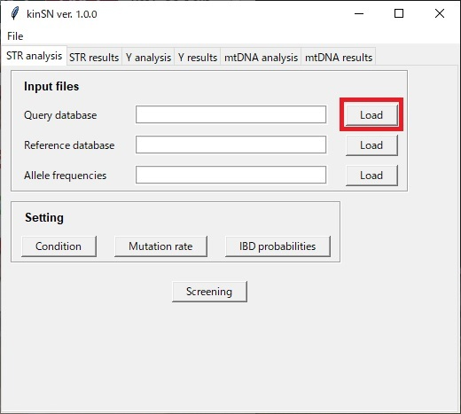

<br />

2. Select a .csv file for query database. Format of query database is shown in Fig. 1.

<br />

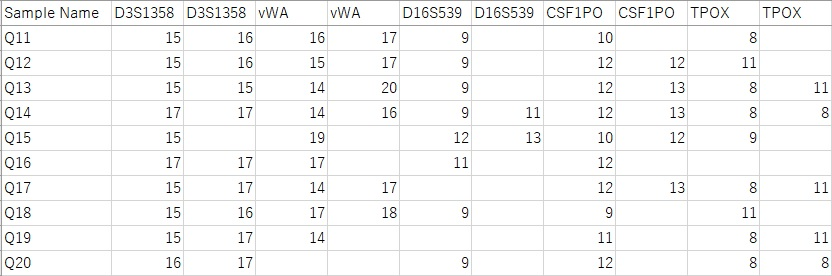

<br />

**Note : format of query database**

- This file must include information regarding 'Sample Name' and each marker.
    
- There are two columns in each marker.

- The marker with two empty cells (e.g., vWA of sample 'Q20' in Fig. 1) is ignored when calculating the LR.
  
- The marker with one empty cell (e.g., D16S539 of sample 'Q11' in Fig. 1) can be regarded as allelic drop-out depending on the setting 'Drop-out of query genotypes' (see section 3.4).
    
- An example file named "str_query_example.csv" is located in the folder 'examples'.
    
<br />

## Load reference database

<br />

1. Press the 'Load' button for reference database.

<br />


<br />

2. Select a .csv file for reference database. Format of reference database is shown in Fig. 2.

<br />

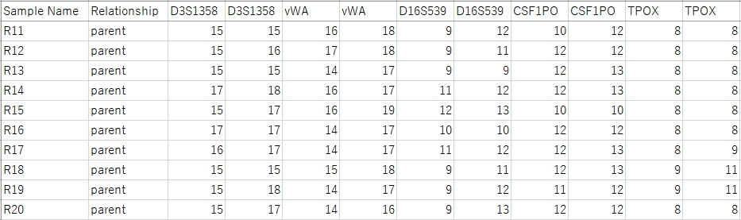

<br />

**Note : format of reference database**
    
- This file must include information regarding 'Sample Name', 'Relationship', and each marker.
    
- There are two columns in each marker.

- Names of the column 'Relationship' relate to those of relationships in the IBD probabilities (see section 3.6).

- If the relationship is not identified, leave the cell blank. When calculating LRs, all relationships for which the IBD probabilities is defined are considered.

- The marker with two empty cells is ignored when calculating the LR.
  
- The marker with one empty cell or with two same alleles (e.g., D3S1358 of sample 'R22' in Fig. 2) is regarded as the homozygotes.
    
- An example file named "str_ref_example.csv" is located in the folder 'examples'.
    
<br />

## Load allele frequencies

<br />

1. Press the 'Load' button for allele frequencies.

<br />

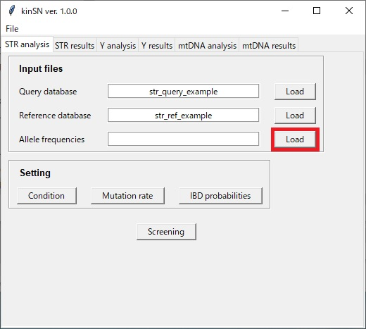

<br />

2. Select a .csv file for allele frequencies. Format of allele frequencies is shown in Fig. 3.

<br />

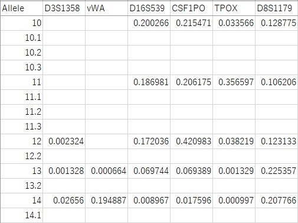

<br />

**Note : format of allele frequencies**
    
- This file must include information regarding 'Allele' and each marker.
    
- An example file named "str_af_example.csv" is located in the folder 'examples'.
    
<br />

## Set conditions of calculation

<br />

1. Press the 'Condition' button.

<br />


<br />
    
2. Set conditions of 'Minimum allele frequency', 'Drop-out of query genotypes', and 'Probability of drop-out'.

<br />

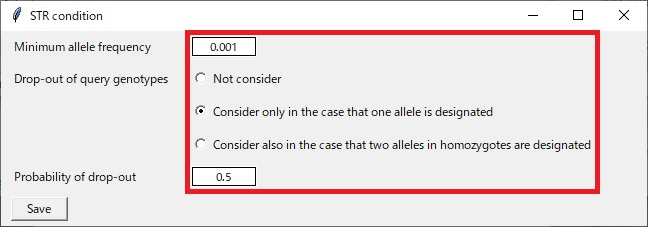
    
<br />

**Note : Drop-out of query genotypes**

- 'Not consider' : 
When calculating the LR, the marker with one empty cell in a query or reference database is regarded as the homozygote. The marker with two empty cells is ignored (i.e., LR = 1).

- 'Consider only in the case that one allele is designated' : 
When calculating the LR, the marker with one empty cell in a query or reference database is regarded as both the homozygote (without drop-out) and the heterozygote (with drop-out). The marker with two empty cells is ignored (i.e., LR = 1).

- 'Consider also in the case that two alleles in homozygotes are designated' : 
When calculating the LR, the marker with two same alleles in a query or reference database is also regarded as both the homozygote (without drop-out) and the heterozygote (with drop-out).

<br />
    
3. Press the 'Save' button.

<br />
    
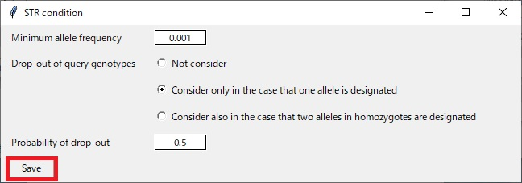
    
<br />

## Set mutation rates

<br />
    
### Edit mutation rates

<br />

1. Press the 'Mutation rate' button. Then the window 'STR mutation' will be open.

<br />
    
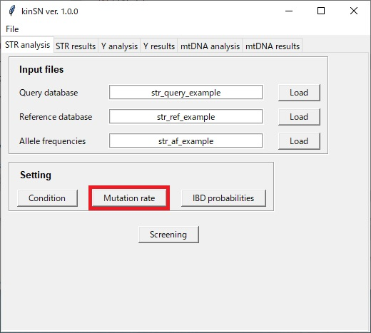
    
<br />
    
2. Select a locus to change the mutation rate.

<br />

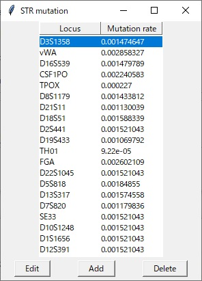
    
<br />
    
3. Press the 'Edit' button. Then the window 'Edit a mutation rate' will be open.

<br />

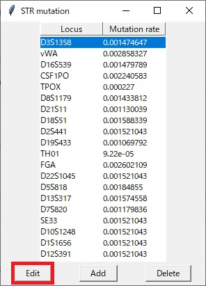
    
<br />
    
4. Enter an arbitrary mutation rate.

<br />

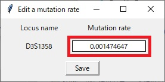
    
<br />
    
5. Press the 'Save' button.

<br />

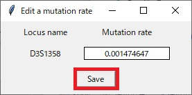
    
<br />
    
### Add a locus

<br />

1. Press the 'Add' button in the window 'STR mutation'. Then the window 'Add a locus' will be open.

<br />

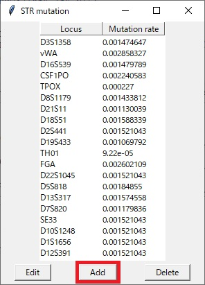
    
<br />

2. Enter an arbitrary locus name.

<br />

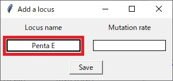
    
<br />
    
3. Enter an arbitrary mutation rate.

<br />
    
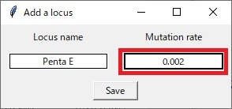
    
<br />
    
4. Press the 'Save' button.

<br />    

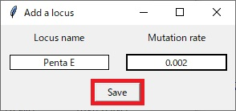
    
<br />
    
### Delete a locus

<br />

1. Select a locus in the window 'STR mutation'.

<br />
    

    
<br />
    
2. Press the 'Delete' button. Then the selected locus will be deleted.

<br />

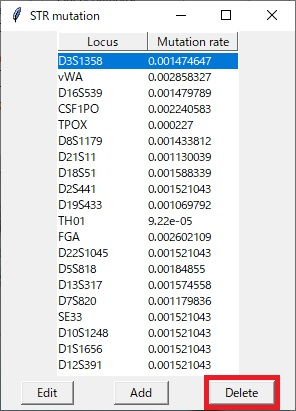
    
<br />

## Set IBD probabilities

<br />

**Note : **

- When the relationship of each reference profile is not identified, all relationships for which the IBD probabilities is defined are considered when calculating the LR.

<br />
    
### Edit IBD probabilities

<br />

1. Press the 'IBD probabilities' button. Then the window 'IBD probabilities' will be open.

<br />

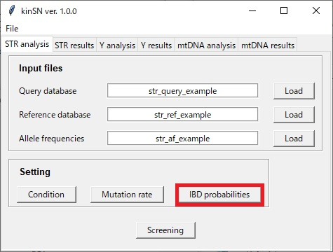
    
<br />
    
2. Select a relationship to change the IBD probabilities.

<br />
    
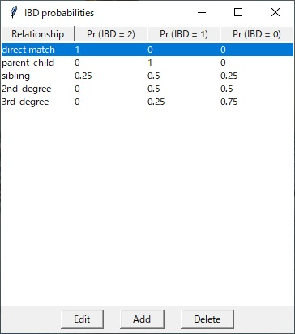
    
<br />
    
3. Press the 'Edit' button. Then the window 'Edit IBD probabilities' will be open.

<br />

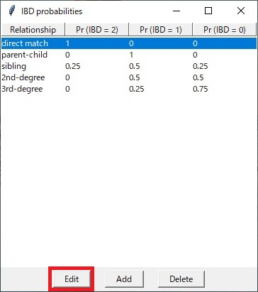
    
<br />
    
4. Enter arbitrary probabilities of IBD = 2, IBD = 1, and IBD = 0.

<br />

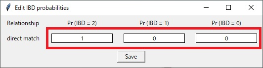
    
<br />
    
5. Press the 'Save' button.

<br />

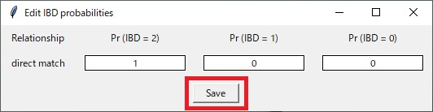
    
<br />
    
### Add a relationship

<br />
    
1. Press the 'Add' button in the window 'IBD probabilities'. Then the window 'Add a relationship' will be open.

<br />

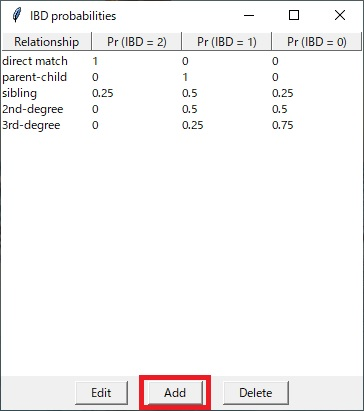
    
<br />
    
2. Enter an arbitrary relationship.

<br />

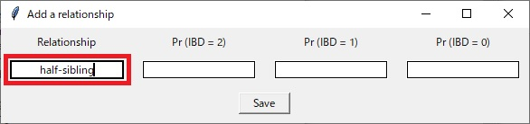
    
<br />
    
3. Enter arbitrary probabilities of IBD = 2, IBD = 1, and IBD = 0.

<br />

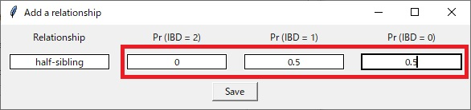
    
<br />
    
4. Press the 'Save' button.

<br />

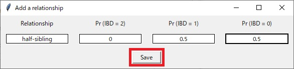
    
<br />
    
### Delete a relationship

<br />
    
1. Select a relationship in the window 'IBD probabilities'.

<br />


    
<br />
    
2. Press the 'Delete' button. Then the selected relationship will be deleted.

<br />    


    
<br />

## Perform screening

<br />

1. Press the 'Screening' button.

<br />


    
<br />

2. Wait until the screening finishes.

<br />

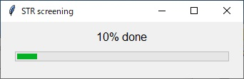

<br />

## Check the result of screening

<br />

1. After finishing the screening, the result of the screening will be displayed.

<br />

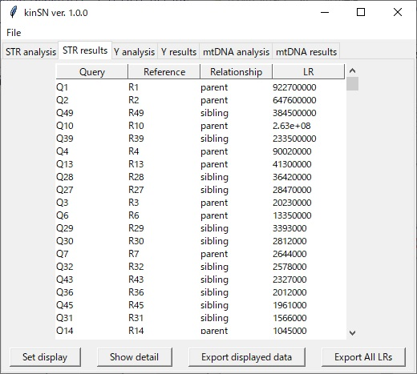

<br />

**Note : Default display**
    
- All query names
    
- All reference names
    
- All relationships
    
- Likelihood ratio (LR) > 1
    
- Descending order of LR
    
<br />
    
### Change the displayed information

<br />

1. Press the 'Set display' button. Then the window 'Set display' will be open.

<br />

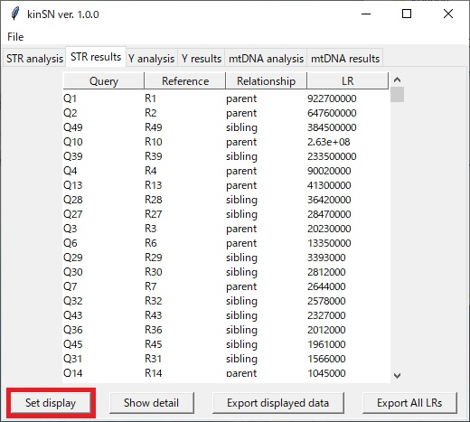

<br />

2. Select a query name, a reference name, and a relationship.

<br />

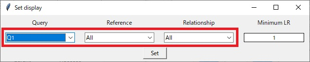

<br />

3. Enter the minimum LR.

<br />


<br />

4. Press the 'Set' button.

<br />

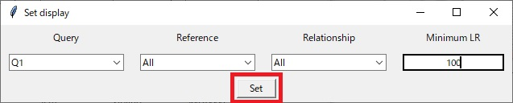

<br />
    
### Show the result of a query-reference pair in detail

<br />

1. Select a query-reference pair.

<br />

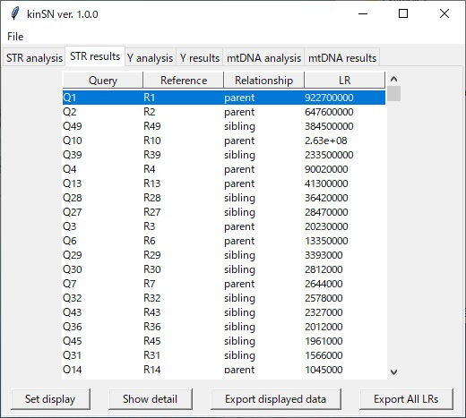

<br />

2. Press the 'Show detail' button. Then the window 'STR result in detail' will be open.

<br />

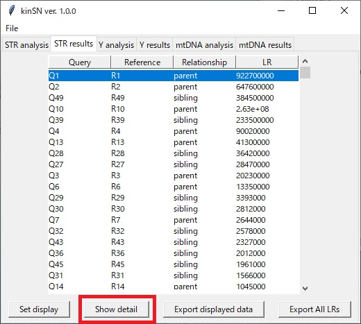

<br />

3. Press the 'Export' button to save the displayed data.

<br />

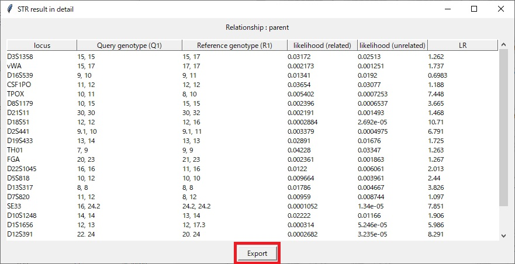

<br />
    
### Export data

<br />    

1. Press the 'Export displayed data' to save the displayed data in the tab 'STR results'.

<br />

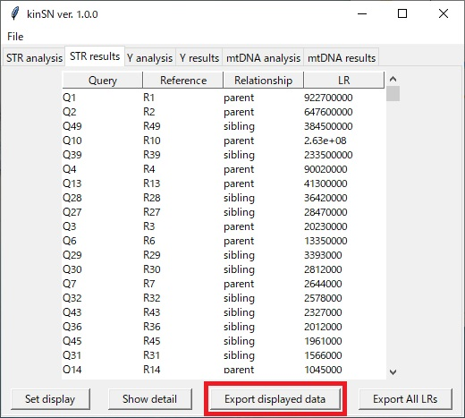

<br />

2. Press the 'Export All LRs' to save all LR values.

<br />

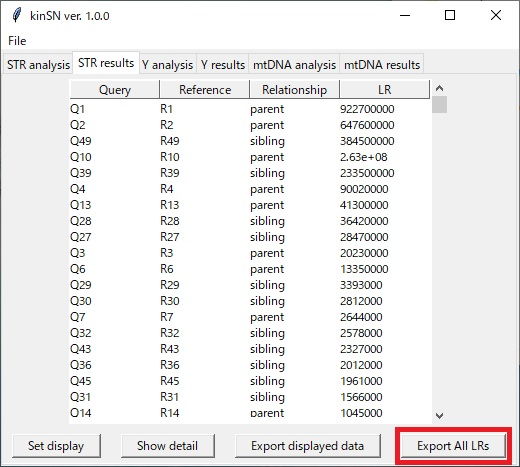

<br />

---

# Y-chromosomal STR

<br />

## Load query database

<br />

1. Press the 'Load' button for query database.

<br />

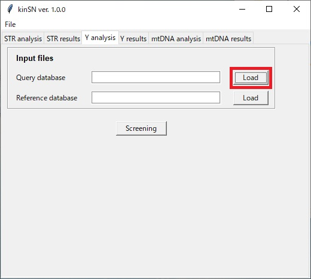

<br />

2. Select a .csv file for query database. Format of query database is shown in Fig. 4.

<br />

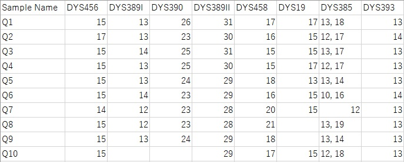

<br />

**Note : format of query database**

- This file must include information regarding 'Sample Name' and each marker.
    
- There is one column in each marker.

- In the marker with more than one allele, each allele must be separated by a comma (e.g., DYS385).
  
- The marker with an empty cell (e.g., DYS390 of sample 'Q10' in Fig. 4) is regarded as the 'ignored loci'.
    
- An example file named "y_query_example.csv" is located in the folder 'examples'.

<br />

## Load reference database

<br />

1. Press the 'Load' button for reference database.

<br />


<br />

2. Select a .csv file for reference database. Format of reference database is shown in Fig. 5.

<br />

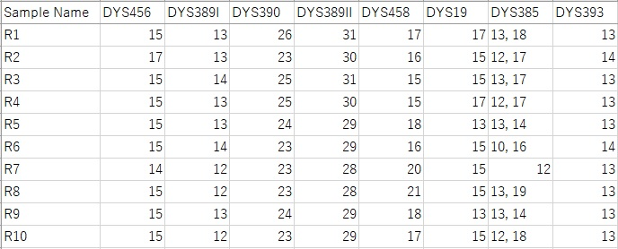

<br />

**Note : format of reference database**

- This file must include information regarding 'Sample Name' and each marker.
    
- There is one column in each marker.

- In the marker with more than one allele, each allele must be separated by a comma (e.g., DYS385).
    
- An example file named "y_ref_example.csv" is located in the folder 'examples'.

<br />

## Perform screening

<br />

1. Press the 'Screening' button.

<br />

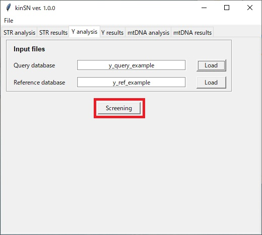

<br />

2. Wait until the screening finishes.

<br />

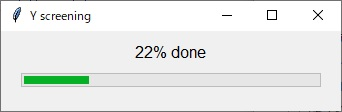

<br />

## Check the result of screening

<br />

1. After finishing the screening, the result of the screening will be displayed.

<br />

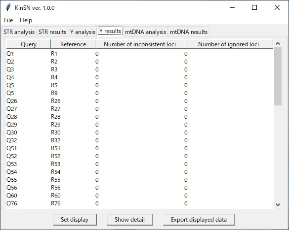

<br />

**Note : Default display**
    
- All query names
    
- All reference names
    
- Number of inconsistent loci : 0 or 1
    
- Number of ignored loci : 0 or 1

- Ascending order of the number of inconsistent loci and the number of ignored loci
    
<br />

### Change the displayed information

<br />

1. Press the 'Set display' button. Then the window 'Set display' will be open.

<br />

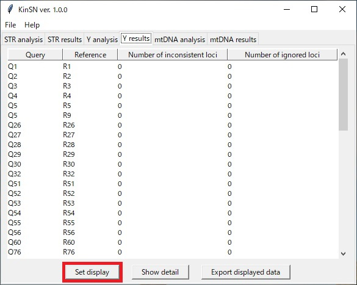

<br />

2. Select a query name and a reference name.

<br />

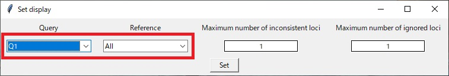

<br />

3. Enter the minimum number of inconsistent loci and the maximum number of loci explained by drop-outs.

<br />

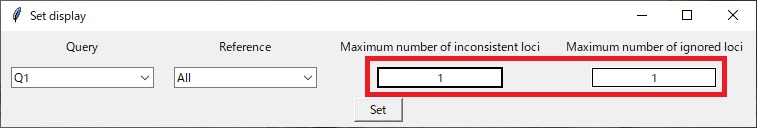

<br />

4. Press the 'Set' button.

<br />

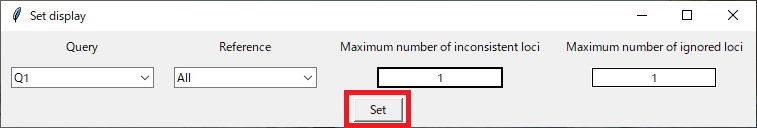

<br />

### Show the result of a query-reference pair in detail

<br />

1. Select a query-reference pair.

<br />

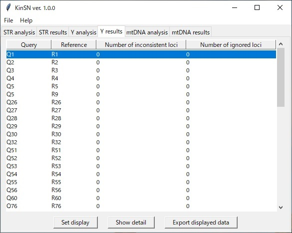

<br />

2. Press the 'Show detail' button. Then the window 'Y result in detail' will be open.

<br />

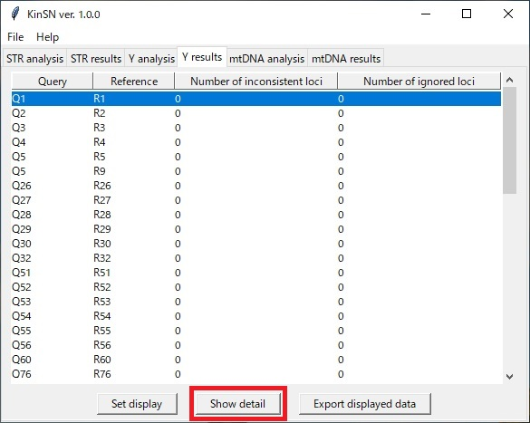

<br />

3. Press the 'Export' button to save the displayed data.

<br />

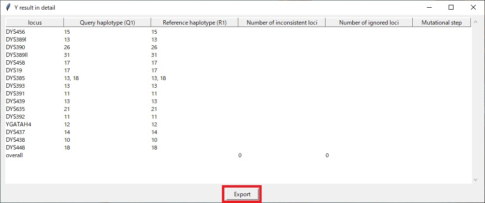

<br />

### Export data

<br />    

1. Press the 'Export displayed data' to save the displayed data in the tab 'Y results'.

<br />

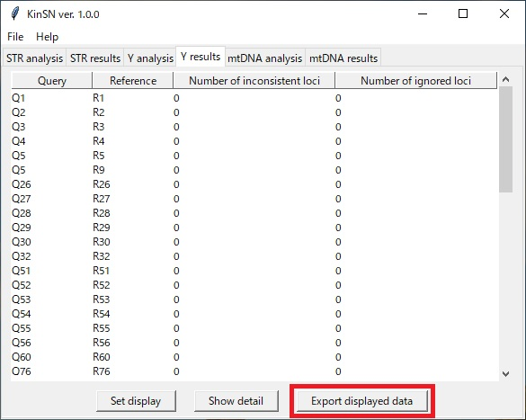

<br />

---

# Mitochondrial DNA

<br />

## Load query database

<br />

1. Press the 'Load' button for query database.

<br />


2. Select a .csv file for query database. Format of query database is shown in Fig. 6.

<br />


<br />

**Note : format of query database**

- This file must include information regarding 'Sample Name', 'Range', and 'Haplotype'.
    
- An example file named "mt_query_example.csv" is located in the folder 'examples'.

<br />

## Load reference database

<br />

1. Press the 'Load' button for reference database.

<br />


<br />

2. Select a .csv file for reference database. Format of reference database is shown in Fig. 7.

<br />


<br />

**Note : format of reference database**

- This file must include information regarding 'Sample Name', 'Range', and 'Haplotype'.
    
- An example file named "mt_ref_example.csv" is located in the folder 'examples'.

<br />

## Perform screening

<br />

1. Press the 'Screening' button.

<br />


<br />

2. Wait until the screening finishes.

<br />


<br />

## Check the result of screening

<br />

1. After finishing the screening, the result of the screening will be displayed.

<br />


<br />

**Note : Default display**
    
- All query names
    
- All reference names
    
- Shared length > 300
    
- Number of inconsistency : 0 or 1

- Descending order of the shared length

- Ascending order of the number of inconsistency
    
<br />

### Change the displayed information

<br />

1. Press the 'Set display' button. Then the window 'Set display' will be open.

<br />


<br />

2. Select a query name and a reference name.

<br />


<br />

3. Enter the minimum shared length and the maximum number of inconsistency.

<br />


<br />

4. Press the 'Set' button.

<br />


<br />

### Show the result of a query-reference pair in detail

<br />

1. Select a query-reference pair.

<br />


<br />

2. Press the 'Show detail' button. Then the window 'mtDNA result in detail' will be open.

<br />


<br />

3. Press the 'Export' button to save the displayed data.

<br />


<br />

### Export data

<br />    

1. Press the 'Export displayed data' to save the displayed data in the tab 'mtDNA results'.

<br />


<br />

---

# Manage projects

<br />

## New project

<br />

1. Select **File -> New project**.

<br />


<br />

## Load project

<br />

1. Select **File -> Load project**.

<br />


<br />

2. Select a project file (.RData).

<br />

## Save project

<br />

1. Select **File -> Save project**.

<br />


<br />

---


